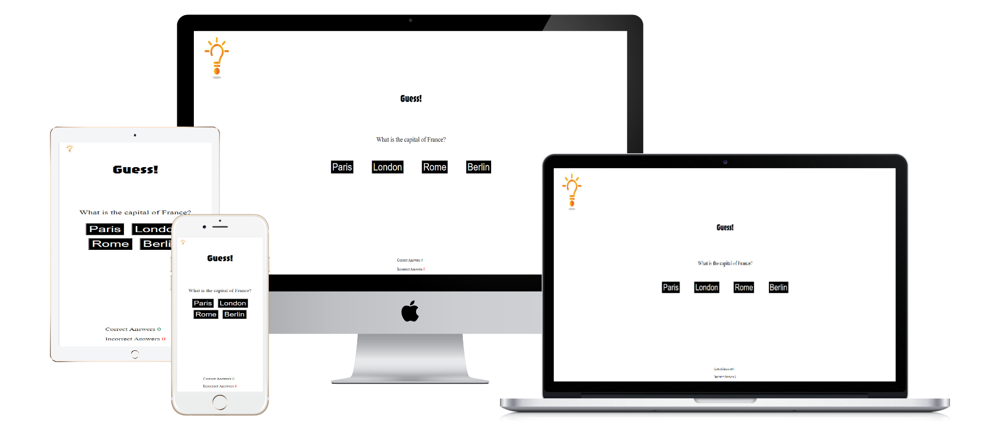
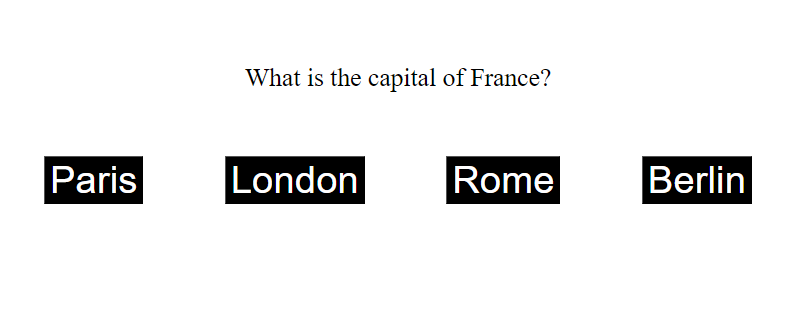
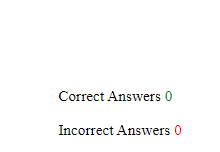

# Guess!

Welcome to Guess!, your premier destination for an 
exhilarating quiz experience! Dive into a diverse array of topics. Our engaging quizzes are meticulously crafted to entertain and challenge users of all skill levels, with multiple difficulty levels ensuring a satisfying experience for everyone. With our mobile-friendly platform, you can enjoy the thrill of trivia mastery anytime, anywhere. Join us now and unleash your inner quiz champion!

## Features

Our quiz game boasts an array of captivating features designed to immerse players in a thrilling trivia experience. With an extensive library of questions spanning diverse topics such as geography, history, and pop culture, players can test their knowledge across a multitude of subjects. The intuitive interface offers seamless navigation, allowing players to easily progress through questions and track their scores in real-time. Engage in friendly competition with friends or challenge yourself. The visually appealing design, coupled with responsive layouts, ensures an enjoyable experience across all devices. Our quiz game promises endless hours of entertainment and enlightenment for players of all ages.

### Existing Features

- __The Guess! Logo and Heading__

  - Featured at the top of the page, the Guess! logo and heading is easy to see for the user. Upon viewing the page, the user will be able to see the name of the game.

- __The Game Area__

  - This section will allow the user to play the game. The user will be able to easily see the questions and buttons with answers. 

- __The Score Area__

  - This section will allow the user to see the score. The user will be able to easily see real time score. 

## Testing

- HTML
    - No errors were returned when passing through the official W3C validator
- CSS
    - No errors were found when passing through the official Jigsaw validator
- JavaScript
    - No errors were found when passing through the official Jshint validator

## Deployment

This section should describe the process you went through to deploy the project to a hosting platform (e.g. GitHub) 

- The site was deployed to GitHub pages. The steps to deploy are as follows: 
  - In the GitHub repository, navigate to the Settings tab 
  - From the source section drop-down menu, select the main Branch
  - Once the main branch has been selected, the page will be automatically refreshed with a detailed ribbon display to indicate the successful deployment. 

The live link can be found here - https://cosmin2002trusca.github.io/guess/

## Credits

- Our quiz game boasts an array of captivating features inspired by the innovative design of the 'Love Maths' project, particularly in the implementation of the score area.
